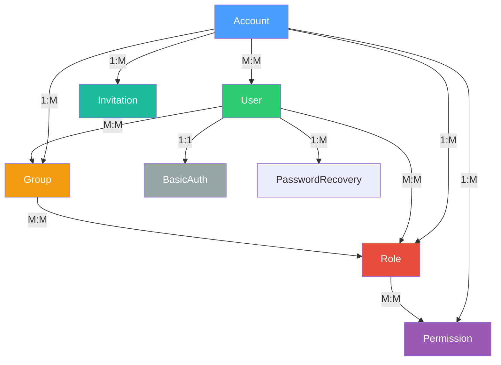

# Domains

Each domain in Corely.IAM follows a consistent folder structure and naming pattern.

## Entity Relationships



## Folder Structure

Each domain uses:

```
Domain/
├── Constants/        # Domain constants (SCREAMING_SNAKE_CASE)
├── Entities/         # EF Core entities
├── Models/           # Request/response/domain models
├── Processors/       # Business logic + authorization/telemetry decorators
├── Mappers/          # Entity ↔ Model mapping
└── Validators/       # FluentValidation rules
```

## Shared Patterns

- **Result pattern** — all operations return typed result objects with result codes, not exceptions
- **Account scoping** — groups, roles, permissions, and invitations are scoped to an account via `AccountId`
- **M:M relationships** — use explicit join entities with `DeleteBehavior.NoAction` (SQL Server constraint)
- **ChildRef** — lightweight `record ChildRef(Guid Id, string Name)` used in hydrated collections
- **Constants** — `SCREAMING_SNAKE_CASE`, defined in `Constants/` folder per domain

## Topics

- [Accounts](accounts.md)
- [Users](users.md)
- [Groups](groups.md)
- [Roles](roles.md)
- [Permissions](permissions.md)
- [Basic Auths](basic-auths.md)
- [Password Recoveries](password-recoveries.md)
- [Invitations](invitations.md)
