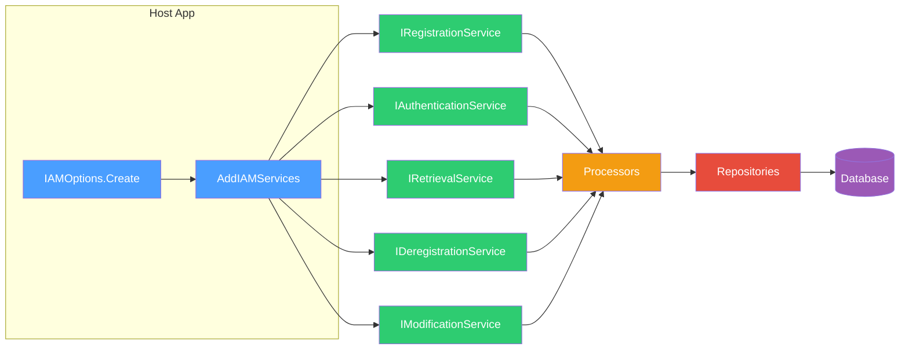

# Corely.IAM Documentation

Host-agnostic, multi-tenant identity and access management for .NET applications. Provides authentication, authorization, RBAC, and permission management with no external service dependencies. Supports MySQL, MariaDB, and SQL Server.



- **Multi-tenant accounts** — users belong to multiple accounts with scoped RBAC
- **CRUDX permissions** — fine-grained Create/Read/Update/Delete/Execute per resource type
- **Token-based authentication** — JWT with custom claims, no HttpContext dependency
- **System context** — headless processes (Azure Functions, background services) can call APIs without user authentication
- **Multi-factor authentication** — TOTP (authenticator apps) with recovery codes
- **Google Sign-In** — link Google accounts as an alternative auth method
- **Invitation system** — token-based onboarding with expiry and revocation
- **Per-entity encryption keys** — account and user-scoped key pairs, stored encrypted
- **Pluggable crypto** — configure algorithms via the `IAMOptions` builder
- **Resource type registry** — built-in + custom resource types for validation and UI

## Topics

- [Step-by-Step Setup](step-by-step-setup.md)
- [IAMOptions Configuration](iam-options.md)
- [Authentication](authentication.md)
- [Authorization](authorization.md)
- [Resource Types](resource-types.md)
- [Services](services/index.md)
    - [Registration](services/registration.md)
    - [Deregistration](services/deregistration.md)
    - [Retrieval](services/retrieval.md)
    - [Modification](services/modification.md)
    - [Authentication Service](services/authentication-service.md)
- [Domains](domains/index.md)
    - [Accounts](domains/accounts.md)
    - [Users](domains/users.md)
    - [Groups](domains/groups.md)
    - [Roles](domains/roles.md)
    - [Permissions](domains/permissions.md)
    - [Basic Auths](domains/basic-auths.md)
    - [Invitations](domains/invitations.md)
    - [TOTP Auth](domains/totp-auths.md)
    - [Google Auth](domains/google-auths.md)
- [Multi-Factor Authentication](mfa.md)
- [Google Sign-In](google-signin.md)
- [Security](security/index.md)
    - [Key Management](security/key-management.md)
    - [User Context](security/user-context.md)
- [Architecture](architecture.md)
- [Result Codes](result-codes.md)

### Tools

- [DevTools CLI](../../Corely.IAM.DevTools/Docs/index.md) — crypto operations, IAM service interaction
- [Migration CLI](../../Corely.IAM.DataAccessMigrations.Cli/Docs/index.md) — database creation, migrations, scripting

## Quick Start

```csharp
var options = IAMOptions.Create(configuration, securityConfigProvider, efConfigFactory);
services.AddIAMServices(options);

// Register a user and account
var registrationService = serviceProvider.GetRequiredService<IRegistrationService>();

var userResult = await registrationService.RegisterUserAsync(
    new RegisterUserRequest("admin", "admin@example.com", "P@ssw0rd!"));

var accountResult = await registrationService.RegisterAccountAsync(
    new RegisterAccountRequest("My Organization"));
```

## Database Providers

| Provider | EF Configuration Class |
|----------|----------------------|
| SQL Server | `MsSqlEFConfiguration` |
| MySQL | `MySqlEFConfiguration` |
| MariaDB | `MySqlEFConfiguration` |
