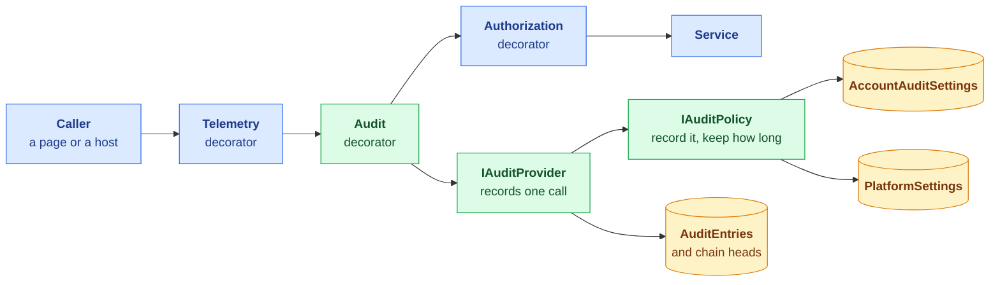
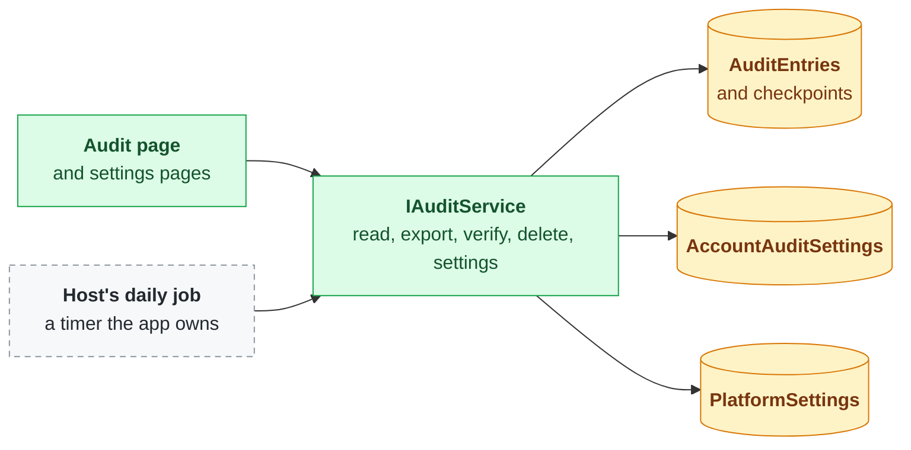
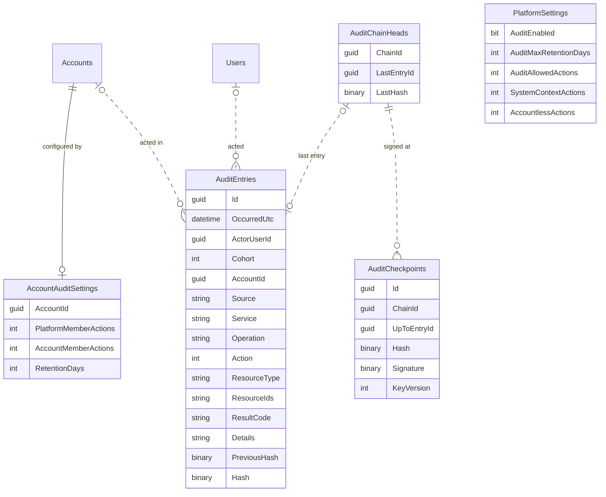
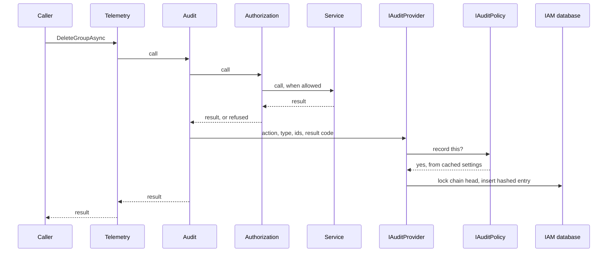
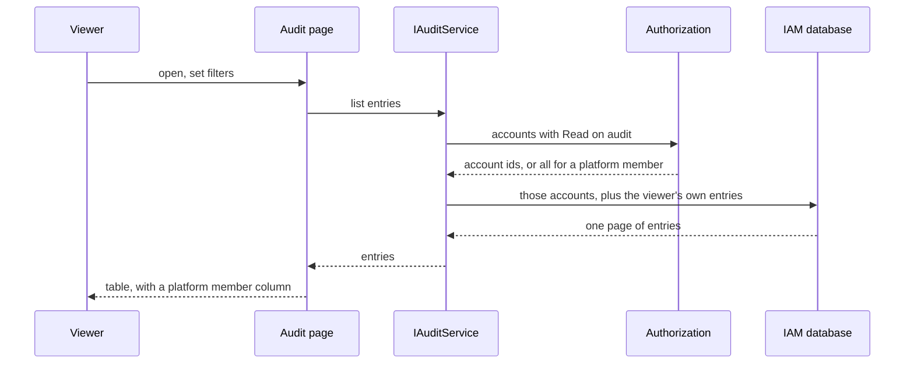

# Auditing

**Status: not started.** Part of the platform account fast follow
([platform-account-hardening.md](platform-account-hardening.md)): no stable IAM release carries the
platform account until this is done. The platform account is out as previews (Corely.IAM
3.4.0-preview.1, IAM.Web 3.3.0-preview.1, the CLI 3.1.0-preview.1).

## Summary

We are building an audit log for IAM and the apps that use it. Every service method can write an
entry saying who did what, in which account, and whether it was allowed. What actually gets written is
up to the platform and to each account:

- **The platform** has a switch for the whole system, a maximum retention, which actions accounts may
  record, and what is recorded for background processes and for things that happen outside any
  account, such as signing in.
- **Each account** chooses which actions to record for its own members and for platform members, and
  how long to keep them, within those limits.
- **People read it on one audit page** covering every account they may see plus their own activity.
  They can filter it, export up to 10,000 entries as CSV, verify it has not been altered, and delete
  entries older than a date. Old entries are also cleaned up daily.

Nothing from a request's contents is stored, entries cannot be edited, each entry is chained to the
one before by its hash so a changed or removed entry shows up, and auditing is added with the same
decorator pattern authorization already uses.

## How it fits together

### Components: writing entries

### Components: reading and managing

Green is new in IAM, blue exists today, amber is new tables, and the dashed grey box is written by
each app, not shipped by IAM. Billing and DocsToData add audit decorators to their own services,
which call the same `IAuditProvider`.

### Tables

The action columns hold CRUDX as flags. `AuditEntries` refers to users and accounts by id with no
foreign key (the dotted lines), so deleting a user or an account does not delete the record of what
happened. `PlatformSettings` is a single row. A chain's id is its account's id, or `Guid.Empty` for
the platform chain.

### Recording a call

A refused call is recorded the same way, with its refusal code, and a call that throws is recorded as
a fault before the exception carries on. When the policy says no, nothing is written. When writing
the entry fails, the error is logged loudly and the call still returns its result.

### Reading the audit page

Export runs the same query without paging, stops at 10,000 entries, and says so when it stops.

## Why

A platform member's permissions reach every account, and nothing records what anyone did. Auditing
is wanted for everyone, not only platform members: every method of every service can be recorded,
and what is actually recorded is configured, at the platform and per account.

## Decisions

### What an entry is

| Column | Holds |
|--------|-------|
| `Id` | Guid v7, like every other id |
| `OccurredUtc` | From `TimeProvider`. Never read back out of the id |
| `ActorUserId` | Who acted. Empty for system context, and for a failed sign in with a username that does not exist |
| `Cohort` | Account member, platform member, a user outside any account, or system context (below) |
| `AccountId` | The account acted in. Empty for things that happen outside an account: signing in, setting a password, rotating a user's keys |
| `Source` | Which app wrote it (the portal, the Functions app), so system context entries mean something |
| `Service`, `Operation` | The service interface and method |
| `Action`, `ResourceType`, `ResourceIds` | The CRUDX action and what it was on. A created resource's id comes from the result |
| `ResultCode` | The result code returned, refusals included, or `Fault` when the call threw |
| `Details` | A short fact about this operation, never request contents. Only the operations below write it |
| `PreviousHash`, `Hash` | The chain (below) |

**No request contents.** Nothing from a request body is stored, so no secret or personal data lands
in the log by accident.

**Names live only where they are needed.** Entries hold ids, not names. Creating or deleting a user
writes the username into `Details`; creating or deleting an account writes the account name. A user
who still exists is looked up in Users; a deleted one is looked up from their deletion entry. That
entry is the newest thing tied to them, so it outlives everything else they did, and when it ages
out so has every entry that needed it. The same holds for accounts.

**Entries are append-only.** Nothing updates an entry. The only delete is "everything older than a
date" for one account, so no entry can be removed or kept selectively.

**Always recorded, whatever the settings say:** creating and deleting users and accounts (their
names would otherwise be lost), changing audit settings, and deleting audit entries.

### Cohorts and settings

| Cohort | Who | Configured by |
|--------|-----|---------------|
| Account members | A user acting in an account they belong to | The account |
| Platform members | A user acting in an account they are not a member of, through the platform account | The account |
| Outside any account | A user signing in, setting a password, rotating their keys | The platform |
| System context | Headless processes | The platform |

Each cohort has the five CRUDX actions switched on or off. Defaults:

- **Account members and platform members:** Create, Update and Delete on; Read and Execute off.
- **Outside any account:** Create, Update, Delete and Execute on, so sign ins are recorded; Read off.
- **System context:** everything off.

Typed columns, not a key/value or JSON table: the schema and EF enforce types and defaults, and a new
setting is a migration, which IAM already ships for every schema change.

**`PlatformSettings`**, one row, edited in the platform account:

| Setting | Meaning |
|---------|---------|
| `AuditEnabled` | System-wide switch. Off records nothing anywhere |
| `AuditMaxRetentionDays` | The longest any account may keep entries. Also the retention for entries outside any account, for system context, and for a deleted account's entries |
| `AuditAllowedActions` | The CRUDX actions any account may switch on. The platform can forbid Read and Execute logging everywhere |
| `SystemContextActions` | What is recorded for system context |
| `AccountlessActions` | What is recorded outside any account |

**`AccountAuditSettings`**, one row per account, edited by the account:

| Setting | Meaning |
|---------|---------|
| `AccountMemberActions`, `PlatformMemberActions` | Which CRUDX actions are recorded for each cohort |
| `RetentionDays` | 0 up to the platform's `AuditMaxRetentionDays` |

**The account decides.** An account that switches a cohort off, including platform members, gets
nothing recorded for it. The platform does not keep a record of its own members' actions inside a
customer account that the customer has declined.

**Rules apply as they stand now; history is never rewritten.** The effective setting is worked out
when it is used: the account's actions within the platform's allowed actions, the account's retention
within the platform's maximum. Lowering a platform limit rewrites no account row, so raising it again
brings each account's own choice back. The cleanup applies whatever retention is in force when it
runs. An account with no settings row uses the defaults, so existing accounts need no backfill.

**`IAuditPolicy`** answers "is this recorded, and for how long" from the platform settings, the
account settings and the cohort. The provider asks it and does nothing else with settings, so a later
rule (a per-account override) changes one type, and the policy is tested on its own.

### Where it runs

- **A hand-written audit decorator per service interface**, each method one call to
  `IAuditProvider` with the action, resource type, ids and result code. This is the pattern
  authorization uses (`CLAUDE.md`: no `DispatchProxy` or other interception).
- **Order: Telemetry, then Audit, then Authorization, then the service.** Audit sits outside
  authorization so refused attempts are recorded with their refusal code; telemetry stays outermost so
  it times the whole call.
- **Every method of every service.** Signing in and switching accounts are authentication service
  methods, so entering an account is recorded like anything else.
- **Best effort.** The entry is written after the call. A failed write is logged as an error and the
  call's result is returned unchanged; the action is never failed or undone because of the audit.
- **The write ignores cancellation.** It reports on a call that has already happened, so it takes no
  cancellation token from the call.
- **The provider writes directly,** never through the decorated `IAuditService`, so recording cannot
  record itself in a loop. Reading the audit log is a Read on `audit` and is recorded only when the
  account records Reads.
- **Hosts audit their own services the same way.** Billing's services get audit decorators in
  Corely.Billing.IAM, which already depends on IAM, and DocsToData's get theirs in DocsToData. Each is
  a release of its own after IAM's.
- **Nothing is missed by accident.** A test fails when any service interface in IAM, Billing or
  DocsToData has no audit decorator registered.

### Performance

- **Settings are cached** per account, with an expiry, the way permissions are. A settings change
  takes effect on other instances when the cache expires.
- **Reads are off by default,** so the busiest calls cost one cache lookup and no write.
- **Indexes:** `(AccountId, OccurredUtc)` for the audit page and the cleanup, `(ActorUserId,
  OccurredUtc)` for a user's own entries.
- **Writes within one chain are serialized** by the chain head lock (below). That is the cost of the
  chain, and it is per account, not system wide.

### Tamper evidence

Each entry stores the hash of the entry before it in its chain, and its own hash over its columns
and that previous hash. Changing or removing an entry in the middle of a chain breaks every hash after
it.

- **One chain per account,** plus one platform chain for entries outside any account and for system
  context. One chain for the whole system would put every audited write behind a single lock.
- **`AuditChainHeads` holds each chain's last entry and hash.** Writing an entry locks its chain's
  head row, so the chain stays correct across several app instances.
- **Daily signed checkpoints.** The host's daily job also records, for each chain, its latest hash
  signed with the platform account's signing key, and the key version, so keys can still rotate. A
  checkpoint proves the chain up to that point existed then.
- **Verify.** `IAuditService` re-walks a chain from its oldest remaining entry, checking each hash
  and each checkpoint's signature, and reports the first break. The audit page has a Verify button.
- **What it cannot catch:** the oldest entries being removed, because retention removes them on
  purpose; and an entry that was never written because its write failed, which best effort accepts.

### Reading and managing it

**`IAuditService`:**

| Action | Method |
|--------|--------|
| Create | Record an entry (the provider's path; not called by pages) |
| Read | List and get, with filters; export as CSV; verify a chain |
| Delete | Delete one account's entries older than a date |

It also reads and updates the account's audit settings and, in the platform account, the platform
settings, and has the two operations the host's daily job calls: delete expired entries, and write
checkpoints.

**Two resource types:**

| Type | Actions used |
|------|--------------|
| `audit` | Read: view, export and verify. Delete: delete older than a date |
| `audit_settings` | Read and Update the account's audit settings |

**The audit page is not tied to one account.** It lives outside the current account, like Profile,
and shows:

- entries in every account where the viewer holds Read on `audit`;
- every entry where the viewer is the actor, which covers their own sign ins, password changes and
  key rotations;
- for a platform member holding Read on `audit` in the platform account, everything, including
  entries with no account and system context.

Filters for account, user, action, resource type, result and date, a column marking platform members,
and a filter to include or exclude them. This is the first list in IAM that spans accounts other than
the account picker.

**Export** downloads what the filters show as CSV, up to 10,000 entries. When the filters match more,
the page says the export stopped at 10,000 and suggests narrowing the date range.

**Other pages:** account audit settings in account management; platform settings in the platform
account.

### Retention

**IAM ships the operation, the app ships the schedule.** `IAuditService` has a method that deletes
each account's entries older than its effective retention and returns how many went. It runs under
system context and is safe to run twice. The app calls it from whatever schedules work there: a timer
triggered function in DocsToData, a hosted service with a timer in a plain web app. IAM ships no
timer, because a Functions app, an App Service that sleeps and a web app scaled across instances each
schedule differently. The same daily job writes the signed checkpoints.

**A deleted account's entries stay** and age out under the platform maximum, since the account's own
settings went with it.

People keep what they care about by exporting it before it ages out.

## First version

- The platform settings: the switch, the maximum retention, the actions accounts may enable, and what
  is recorded for system context and outside any account
- Account settings for their two cohorts, and the account's retention
- Audit decorators on every IAM service, and the test that none is missing; Billing and DocsToData
  after
- The hash chain, chain heads, daily signed checkpoints and Verify
- The cross-account audit page, CSV export capped at 10,000, and delete older than a date
- The retention cleanup and checkpoint operations in IAM, and a daily timer function calling them in
  DocsToData
- The two resource types and their owner defaults

## Later, without redesign

- **Per-account retention beyond the platform maximum** (an account paying to keep five years): one
  nullable override on the account's settings, editable only by platform members, read by
  `IAuditPolicy`.
- **More export controls** than the 10,000 cap.

## Open questions

- **What gates the platform settings page:** Update on `audit_settings` held in the platform account,
  or a `platform_settings` type of its own, since that table will hold more than audit later?
- **Turning `AuditEnabled` off:** do existing entries stay until they age out, or go at once?

## Done when

Every IAM service method passes through an audit decorator, what is recorded follows the platform and
account settings, the audit page shows, exports and verifies entries across the accounts a caller may
read and their own activity, old entries are cleaned up and chains checkpointed on schedule, and
Billing and DocsToData audit their own services the same way.
