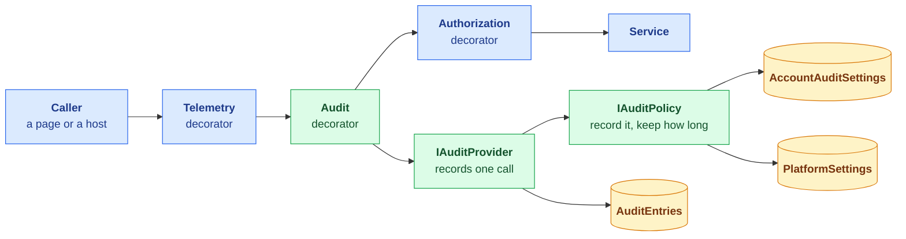
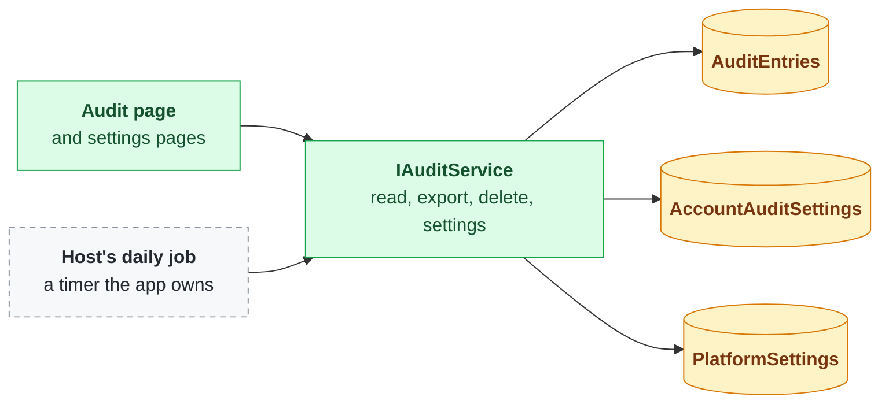
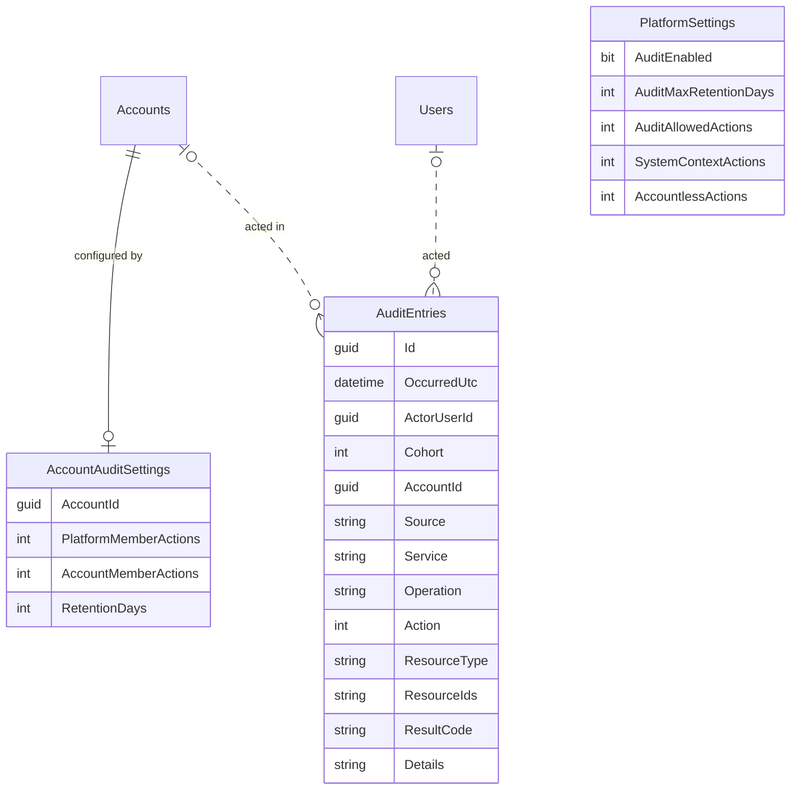
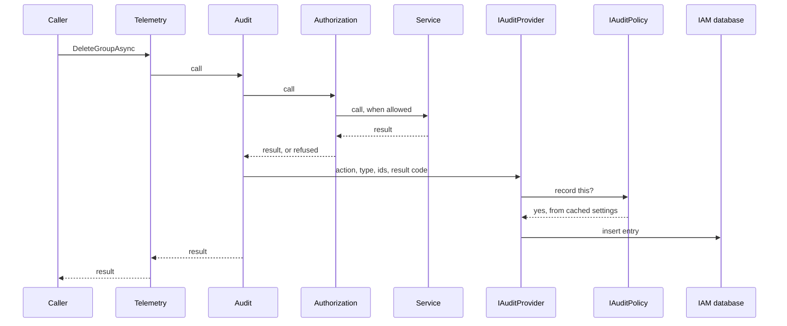
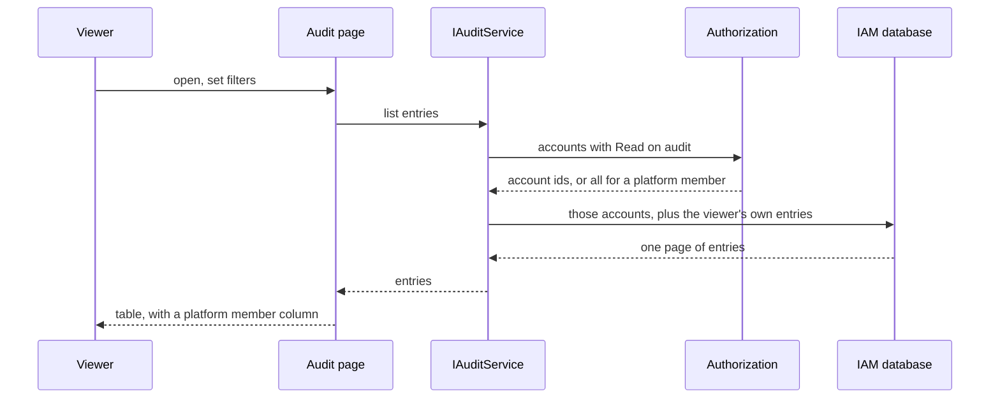

# Auditing

**Status: done and verified in Corely.IAM; released with Corely.IAM 3.4.0, the CLI 3.1.0 and IAM.Web
3.5.0. Billing and DocsToData adopt it in their own repositories.** Part of the platform account fast
follow ([platform-account-hardening.md](Completed/platform-account-hardening.md)).

## Summary

We are building an audit log for IAM and the apps that use it. Every service method can write an
entry saying who did what, in which account, and whether it was allowed. What actually gets written is
up to the platform and to each account:

- **The platform** has a switch for the whole system, a maximum retention, which actions accounts may
  record, and what is recorded for background processes and for things that happen outside any
  account, such as signing in.
- **Each account** chooses which actions to record for its own members and for platform members, and
  how long to keep them, within those limits.
- **People read it on one audit page** covering every account they may see plus their own activity.
  They can filter it, export up to 10,000 entries as CSV, and purge an account's entries, all of them
  or those older than a date. Old entries are also cleaned up daily.

Nothing from a request's contents is stored, entries cannot be edited, and auditing is added with the
same decorator pattern authorization already uses.

## How it fits together

### Components: writing entries

### Components: reading and managing

Green is new in IAM, blue exists today, amber is new tables, and the dashed grey box is written by
each app, not shipped by IAM. Billing and DocsToData add audit decorators to their own services,
which call the same `IAuditProvider`.

### Tables

The action columns hold CRUDX as flags. `AuditEntries` refers to users and accounts by id with no
foreign key (the dotted lines), so deleting a user or an account does not delete the record of what
happened. `PlatformSettings` is a single row.

### Recording a call

A refused call is recorded the same way, with its refusal code, and a call that throws is recorded as
a fault before the exception carries on. When the policy says no, nothing is written. When writing
the entry fails, the error is logged loudly and the call still returns its result.

### Reading the audit page

Export runs the same query without paging, stops at 10,000 entries, and says so when it stops.

## Why

A platform member's permissions reach every account, and nothing records what anyone did. Auditing
is wanted for everyone, not only platform members: every method of every service can be recorded,
and what is actually recorded is configured, at the platform and per account.

## Decisions

### What an entry is

| Column | Holds |
|--------|-------|
| `Id` | Guid v7, like every other id |
| `OccurredUtc` | From `TimeProvider`. Never read back out of the id |
| `ActorUserId` | Who acted. Empty for system context, and for a failed sign in with a username that does not exist |
| `Cohort` | Account member, platform member, a user outside any account, or system context (below) |
| `AccountId` | The account acted in. Empty for things that happen outside an account: signing in, setting a password, rotating a user's keys |
| `Source` | Which app wrote it (the portal, the Functions app), so system context entries mean something |
| `Service`, `Operation` | The service interface and method |
| `Action`, `ResourceType`, `ResourceIds` | The CRUDX action and what it was on. A created resource's id comes from the result |
| `ResultCode` | The result code returned, refusals included, or `Fault` when the call threw |
| `Details` | A short fact about this operation, never request contents. Only the operations below write it |

**No request contents.** Nothing from a request body is stored, so no secret or personal data lands
in the log by accident.

**Names live only where they are needed.** Entries hold ids, not names. Deleting a user writes the
username into `Details`, and deleting an account writes the account name. A user who still exists is
looked up in Users; a deleted one is looked up from their deletion entry. That entry is the newest
thing tied to them, so it outlives everything else they did, and when it ages out so has every entry
that needed it. The same holds for accounts.

**Entries are append-only.** Nothing updates an entry. The only delete is a purge of one account's
entries, all of them or everything older than a date, so no entry can be removed or kept selectively.

**Two operations are always recorded: deleting a user and deleting an account.** The audit decorator
records them whatever the settings say, the system-wide switch included, because without them a
deleted user's or account's name is lost. Everything else follows the settings.

**Entries outlive their account,** so when someone asks what happened in an account after it is gone,
the answer is still there until it ages out under the platform maximum.

### Cohorts and settings

| Cohort | Who | Configured by |
|--------|-----|---------------|
| Account members | A user acting in an account they belong to | The account |
| Platform members | A user acting in an account they are not a member of, through the platform account | The account |
| Outside any account | A user signing in, setting a password, rotating their keys | The platform |
| System context | Headless processes | The platform |

Each cohort has the five CRUDX actions switched on or off. Defaults:

- **Account members and platform members:** Create, Update and Delete on; Read and Execute off.
- **Outside any account:** Create, Update, Delete and Execute on, so sign ins are recorded; Read off.
- **System context:** everything off.

Typed columns, not a key/value or JSON table: the schema and EF enforce types and defaults, and a new
setting is a migration, which IAM already ships for every schema change.

**`PlatformSettings`**, one row, edited in the platform account:

| Setting | Meaning |
|---------|---------|
| `AuditEnabled` | System-wide switch. Off records nothing anywhere except deleting a user or an account |
| `AuditMaxRetentionDays` | The longest any account may keep entries. Also the retention for entries outside any account, for system context, and for a deleted account's entries |
| `AuditAllowedActions` | The CRUDX actions any account may switch on. The platform can forbid Read and Execute logging everywhere |
| `SystemContextActions` | What is recorded for system context |
| `AccountlessActions` | What is recorded outside any account |

**`AccountAuditSettings`**, one row per account, edited by the account:

| Setting | Meaning |
|---------|---------|
| `AccountMemberActions`, `PlatformMemberActions` | Which CRUDX actions are recorded for each cohort |
| `RetentionDays` | 0 up to the platform's `AuditMaxRetentionDays` |

**The account decides.** An account that switches a cohort off, including platform members, gets
nothing recorded for it. The platform does not keep a record of its own members' actions inside a
customer account that the customer has declined.

**Rules apply as they stand now; history is never rewritten.** The effective setting is worked out
when it is used: the account's actions within the platform's allowed actions, the account's retention
within the platform's maximum. Lowering a platform limit rewrites no account row, so raising it again
brings each account's own choice back. The cleanup applies whatever retention is in force when it
runs. An account with no settings row uses the defaults, so existing accounts need no backfill.

**`IAuditPolicy`** answers "is this recorded, and for how long" from the platform settings, the
account settings and the cohort. The provider asks it and does nothing else with settings, so a later
rule (a per-account override) changes one type, and the policy is tested on its own.

### Where it runs

- **A hand-written audit decorator per service interface**, each method one call to
  `IAuditProvider` with the action, resource type, ids and result code. This is the pattern
  authorization uses (`CLAUDE.md`: no `DispatchProxy` or other interception).
- **Order: Telemetry, then Audit, then Authorization, then the service.** Audit sits outside
  authorization so refused attempts are recorded with their refusal code; telemetry stays outermost so
  it times the whole call.
- **Every method of every service.** Signing in and switching accounts are authentication service
  methods, so entering an account is recorded like anything else.
- **Best effort.** The entry is written after the call. A failed write is logged as an error and the
  call's result is returned unchanged; the action is never failed or undone because of the audit.
- **The write ignores cancellation.** It reports on a call that has already happened, so it takes no
  cancellation token from the call.
- **The provider writes directly,** never through the decorated `IAuditService`, so recording cannot
  record itself in a loop. Reading the audit log is a Read on `audit` and is recorded only when the
  account records Reads.
- **Hosts audit their own services the same way.** Billing's services get audit decorators in
  Corely.Billing.IAM, which already depends on IAM, and DocsToData's get theirs in DocsToData. Each is
  a release of its own after IAM's.
- **Nothing is missed by accident.** A test fails when any service interface in IAM, Billing or
  DocsToData has no audit decorator registered.

### Performance

- **Settings are cached** per account, with an expiry, the way permissions are. A settings change
  takes effect on other instances when the cache expires.
- **Reads are off by default,** so the busiest calls cost one cache lookup and no write.
- **Indexes:** `(AccountId, OccurredUtc)` for the audit page and the cleanup, `(ActorUserId,
  OccurredUtc)` for a user's own entries.

### Reading and managing it

**`IAuditService`:**

| Action | Method |
|--------|--------|
| Create | Record an entry (the provider's path; not called by pages) |
| Read | List and get, with filters; export as CSV |
| Delete | Purge one account's entries: all of them, or those older than a date |

It also reads and updates the account's audit settings and, in the platform account, the platform
settings, and has the operation the host's daily job calls to delete expired entries.

**Three resource types,** one per thing, as everywhere else in IAM:

| Type | Actions used |
|------|--------------|
| `audit` | Read: view and export. Delete: purge |
| `audit_settings` | Read and Update an account's audit settings |
| `platform_settings` | Read and Update the platform settings. Only meaningful in the platform account |

`platform_settings` is its own type, not Update on `audit_settings` held in the platform account,
because the platform settings table will hold more than audit.

**The audit page is not tied to one account.** It lives outside the current account, like Profile,
and shows:

- entries in every account where the viewer holds Read on `audit`;
- every entry where the viewer is the actor, which covers their own sign ins, password changes and
  key rotations;
- for a platform member holding Read on `audit` in the platform account, everything, including
  entries with no account and system context.

Filters for account, user, action, resource type, result and date, a column marking platform members,
and a filter to include or exclude them. This is the first list in IAM that spans accounts other than
the account picker.

**Export** downloads what the filters show as CSV, up to 10,000 entries. When the filters match more,
the page says the export stopped at 10,000 and suggests narrowing the date range.

**Purge** is a button on the audit page that opens a modal. The modal asks which account (only those
where the viewer holds Delete on `audit`; for a platform member holding it in the platform account,
also the entries outside any account and from system context), then either everything or everything
older than a chosen date, and confirms with the count about to go. It never removes single entries.

**Switching auditing off and purging are separate.** Turning `AuditEnabled` off stops new entries
and leaves existing ones to age out; removing them is a purge.

**Other pages:** account audit settings in account management; platform settings in the platform
account, gated by `platform_settings`.

### Retention

**IAM ships the operation, the app ships the schedule.** `IAuditService` has a method that deletes
each account's entries older than its effective retention and returns how many went. It runs under
system context and is safe to run twice. The app calls it from whatever schedules work there: a timer
triggered function in DocsToData, a hosted service with a timer in a plain web app. IAM ships no
timer, because a Functions app, an App Service that sleeps and a web app scaled across instances each
schedule differently.

**A deleted account's entries stay** and age out under the platform maximum, since the account's own
settings went with it.

People keep what they care about by exporting it before it ages out.

## First version

- The platform settings: the switch, the maximum retention, the actions accounts may enable, and what
  is recorded for system context and outside any account
- Account settings for their two cohorts, and the account's retention
- Audit decorators on every IAM service, and the test that none is missing; Billing and DocsToData
  after
- The cross-account audit page, CSV export capped at 10,000, and the purge modal
- The retention cleanup operation in IAM, and a daily timer function calling it in DocsToData
- The three resource types and their owner defaults

## Later, without redesign

- **Per-account retention beyond the platform maximum** (an account paying to keep five years): one
  nullable override on the account's settings, editable only by platform members, read by
  `IAuditPolicy`.
- **More export controls** than the 10,000 cap.

## Done when

Every IAM service method passes through an audit decorator, what is recorded follows the platform and
account settings, the audit page shows, exports and purges entries across the accounts a caller may
read and their own activity, old entries are cleaned up on schedule, and Billing and DocsToData audit
their own services the same way.

## Progress

Built in one session on the `auditing` branch (from master at `9654a97`). **Nothing has been run:** no
test, no app, no browser. Every step compiles (`dotnet build Corely.IAM.slnx`, 0 errors) and was
formatted with CSharpier. The container had no .NET SDK, so it was installed from Ubuntu's
`dotnet-sdk-10.0` package (10.0.112). `dotnet ef` could not be installed (tool installs were refused),
so the migrations were generated by a small scratch program calling EF's own
`MigrationsOperations.AddMigration`, the code path `dotnet ef migrations add` runs.

### Done (one commit each)

1. **Tables and migrations.** `AuditEntries` (table name set explicitly; the pluralizer gave
   `AuditEntrys`), `AccountAuditSettings` (key `AccountId`, cascade deleted with the account),
   `PlatformSettings` (one row, `Id` 1). Indexes `(AccountId, OccurredUtc)` and `(ActorUserId,
   OccurredUtc)`. Migration `AddAuditing` in both provider projects.
2. **`IAuditPolicy`** (`Audits/Providers`), with a singleton `AuditSettingsCache`. The rules live on the
   models: `PlatformSettings.RecordedActions(cohort, account)`,
   `AccountAuditSettings.EffectiveActions` and `EffectiveRetentionDays`. The two always recorded
   operations are `IDeregistrationService.DeregisterUserAsync` and `DeregisterAccountAsync`.
3. **`IAuditProvider`**: `RecordAsync(AuditCall, operation, outcome)`; the operation name comes from
   `[CallerMemberName]`. Faults are recorded and rethrown, write failures logged as errors, written
   with `CancellationToken.None`.
4. **Audit decorators on every service** (`Services/*AuditDecorator.cs`, including `IPlatformService`
   and `IAuditService`), registered Telemetry, Audit, Authorization, service.
   `Audits/Decorators/AuditDecoratorCoverageTests` walks each resolved service's `_inner` chain and
   fails when an interface in `Corely.IAM.Services` has no audit decorator or the order is wrong.
   `AuditDecoratorTests` calls every method of every audit decorator by reflection.
5. **`IAuditService`** with authorization, audit and telemetry decorators, plus `IAuditAccessProvider`
   for the cross-account reach. Integration tests in `Corely.IAM.IntegrationTests/Auditing`.
6. **Resource types** `audit` (owner: Read, Delete), `audit_settings` (owner: Read, Update),
   `platform_settings` (owner: none), in `ResourceTypeRegistry`.
7. **Corely.IAM.Web**: `/audit` (`Pages/Audit/AuditLog.razor`, `Shared/AuditPurgeModal.razor`,
   `js/file-download.js`), the account's audit section (`Shared/AuditSettingsSection.razor` on
   AccountDetail), `/platform-settings` (`Pages/Platform/PlatformSettingsPage.razor`), nav links. The
   WebApp gets `Auditing/AuditCleanupService` (runs at start, then daily); the functional test host
   removes it.
8. **Docs**: `Corely.IAM/Docs/auditing.md`, plus updates to index, architecture, iam-options,
   resource-types, platform and services; `Corely.IAM.Web/Docs/pages/audit.md`, pages index and
   accounts. CLAUDE.md's decorator paragraph names the new order.

### Next

The verifying session: run `.\RebuildAndTest.ps1` (or `dotnet test --solution Corely.IAM.slnx`) and
fix what fails, run the provider matrix with Docker for the new migration, then check the pages in the
WebApp. Billing and DocsToData adopt auditing in their own repositories.

### Where to look first

- **Mock repo assumptions.** `AuditServiceTests` relies on the mock repo's `EvaluateAsync` supporting
  `CountAsync`, as the processors' tests already rely on `FirstOrDefaultAsync`. Purge and cleanup use
  `ExecuteDeleteAsync` through `EvaluateAsync`, which only EF can run, so they are tested only in the
  integration tier. `Corely.DataAccess` has no `ExecuteDeleteAsync` on the repo; adding one there
  would be cleaner.
- **`AuditDecoratorTests`** builds arguments with AutoFixture and returns null `FilterBuilder` and
  `OrderBuilder`; if AutoFixture cannot build some request, that is where it fails.
- **`AuditProviderTests`** fakes the scope factory, since the provider writes in its own scope.
- **Integration tests** assume the scenario's frozen clock: every entry the scenario writes has the
  same `OccurredUtc`, which the purge and cleanup tests depend on.

### Decisions the plan did not cover

- **Empty means null.** `ActorUserId` and `AccountId` are nullable columns; "empty" in the plan is
  stored as `NULL`. In `AuditCall`, `AccountId = null` means the caller's current account and
  `Guid.Empty` means outside any account.
- **Membership is checked before and after the call.** A user who was a member at either point is an
  account member, so leaving an account, accepting an invitation and creating an account are account
  member entries. Everyone else acting in the account is a platform member.
- **The entry is written in its own DI scope** (its own `DbContext`), so a failed operation's pending
  changes are never saved by the audit write, and a host's unit of work rolling back keeps the entry.
- **Not recorded:** `AuthenticateWithTokenAsync` (runs on every request) and `AuthenticateAsSystem`
  (synchronous). Both only set the context that the calls after them carry. Everything else on every
  service is recorded subject to settings.
- **Action and resource per method**, following the permission each call is authorized with where
  there is one: membership and assignment calls are an Update of the parent (`account`, `group`,
  `role`, `user`) with the parent's id first, then the ids added or removed; invitations are an
  Update of `account`; sign in, MFA verification, sign out and switching accounts are Execute
  (switching is on `account`, in the entered account); renewing a token is a Read; sessions, MFA and
  Google linking are on `user` outside any account; `CompletePlatformOwnerPermissionsAsync` is an
  Update on `permission`.
- **Signing in to an account** (`SignInRequest.AccountId` set) records in that account, since it
  enters it; signing in without one is outside any account.
- **Defaults not in the plan:** platform maximum retention 365 days, account retention 90 days.
- **Account retention is validated** against the current platform maximum when saved (0 to max);
  stored values are still clamped when used, so lowering the maximum later rewrites nothing.
- **`platform_settings` checks need the grant in the platform account itself** (system context
  passes), so a customer owner who somehow held it in their own account still cannot change it.
- **Cross-account reach** comes from a direct permission query (`AuditAccessProvider`), not
  `IAuthorizationProvider`, which only loads the current and the platform account. An audit
  permission counts for an account when its resource id is `Guid.Empty` or that account's id;
  everything is a wildcard `audit` permission in the platform account.
- **Purge of "outside any account"** is `AccountId = null`; system context entries made inside an
  account belong to that account.
- **Deleting expired entries requires system context**; anything else is refused.
- **Names on entries:** `AuditEntry.ActorName` and `AccountName` are filled by the service from Users
  and Accounts, or from the deletion entry.
- **CSV**: header plus one row per entry, fields quoted when needed and prefixed with `'` when they
  start with `=`, `+`, `-` or `@` (spreadsheet formula injection).
- **`IAuditService` has no Create method.** The plan's table lists Create as the provider's path;
  recording only ever goes through `IAuditProvider`.

### Unsure, worth a look

- **Existing accounts get no audit owner rows.** Owner defaults apply to accounts created afterwards,
  as for every type, so owners of accounts created before this see only their own entries until a
  host grants `audit` and `audit_settings`. A backfill (like `PlatformOwnerPermissionsStartup`) may be
  wanted before a stable release.
- **`CompletePlatformOwnerPermissionsAsync` writes an accountless Update entry at every startup**
  with no actor. Harmless, but noisy; skipping it when nothing was added would need the outcome to
  be able to decline.
- **Switching accounts is Execute, which accounts do not record by default**, so a platform member
  entering a customer account leaves no entry unless the account turns Execute on for platform
  members. Their changes inside it are recorded. If entering should be visible by default, either
  record switching as another action or change the platform member defaults.
- **The settings cache is not invalidated on account deletion**; for up to the cache expiry the
  cleanup may still use the deleted account's own retention instead of the platform maximum.
- **The purge modal lists only existing accounts**, so a deleted account's entries can only be
  purged through the API (or age out under the platform maximum).

### First verification run (end of the build session, no fixes made)

Run in the cloud container on Linux; Docker container tests skipped.

- `Corely.IAM.UnitTests`: 1831 tests, **2 failed**:
  - `PermissionProcessorTests.DeletePermission_ReturnsSystemDefinedPermissionError_ForAllSystemDefinedPermissions`, most likely an assumption about the owner default rows that the new audit types change.
  - `AuditProviderTests.Record_UsesTheOperationName_FromTheCaller`: the recorded operation name is not the helper method's name. Check what `[CallerMemberName]` gives here before changing the provider.
- `Corely.IAM.IntegrationTests`: 164 tests, 150 passed, 0 failed (the 14 not run are the Docker provider matrix).
- `Corely.IAM.Web.UnitTests`: 163 tests, 0 failed.
- `Corely.IAM.Web.FunctionalTests`: 88 tests, 0 failed.

Not done yet: the provider matrix with Docker (the new migration on MySQL and SQL Server), the DevTools and migration CLI unit tests, and checking the pages in a browser.

### Second verification run (on the owner's PC)

- Both failing unit tests fixed. `[CallerMemberName]` was on `IAuditProvider` only, so a caller
  holding `AuditProvider` itself recorded an empty operation name; the attribute is now on the
  implementation too. The owner default count in the permission test was stale (audit types add two
  rows).
- `dotnet test --solution Corely.IAM.slnx`: 2283 tests, 0 failed, 14 skipped (the container tests).
- Provider matrix with Docker: 14 of 14 passed on MySQL and SQL Server, so `AddAuditing` applies on
  both. The matrix does not assert that entries are written; a failed write is only logged.
- WebApp against LocalDB: the migration applied, the platform Owner role got the three new types at
  startup, and the cleanup ran (0 deleted).
- **The audit provider now does all its database work in its own scope**, not only the write. Its
  policy, membership and name reads used the caller's `DbContext`, and in a Blazor circuit they
  collided with other components' queries ("A second operation was started on this context").

**Blocking, decision needed: Blazor circuits share one `DbContext` across components.** `/audit`
never finishes loading: the nav bar's `ListAccountsAsync` and the page's `ListAuditAccountsAsync`
run at once on the circuit's scoped context, the nav bar's exception is unhandled and kills the
circuit, and the page stays on its spinner. `/profile` fails the same way **on master too** (its
sections load concurrently), so the race predates auditing; the audit decorator's extra awaits only
change which calls overlap. Fixing it is a change to how IAM.Web (or IAM) gets a `DbContext` in a
long-lived scope, for example a context per operation from `IDbContextFactory`, or serializing a
circuit's service calls. Until then `/audit`, `/platform-settings` and the account audit section are
unchecked in a browser.

### Third verification run (after Blazor owned scopes)

- Merged into master after `Corely.IAM.Web` gave every component that calls services its own DI
  scope (`Plans/Completed/blazor-owned-scopes.md`). The audit page, purge modal, settings section and platform
  settings page got the same treatment; `AuditLog` disposes its download module in
  `DisposeAsyncCore`.
- Browser, WebApp on LocalDB with a freshly bootstrapped platform account, server log captured:
  `/audit` as the platform owner (25 rows, all six accounts in the filter, CSV export of 278 entries,
  the purge modal listing every account plus outside any account), `/platform-settings`, and the audit
  section on the platform account's page all load. As a customer owner (`alice.johnson` in North
  America) `/audit` offers only their account. The log had no warnings or errors.
- **Existing accounts get no audit owner rows:** kept, since the owner defaults rule
  (`Docs/resource-types.md`) already says existing accounts keep their rows and the host provisions
  anything beyond. `Docs/auditing.md` now says what an existing account's owners lack until the host
  grants `audit` and `audit_settings`.
- The WebApp demo seed's permission counts now include the two audit owner rows.
- `RebuildAndTest.ps1`: 2298 tests, 0 failed, 14 skipped (the container tests).

### Fourth verification run (the features end to end)

Browser, WebApp on LocalDB reseeded with a bootstrapped platform account, rows checked in the database.

- **Account owner** (`alice.johnson`, North America): the audit section saved Read on for members and
  30 days, and the next read was recorded at once. `/audit` showed the account's entries and her own;
  export wrote 110 entries; the purge modal offered only her account, the review counted 102, and the
  purge removed 103 because this account now records reads, so the review's own count was recorded
  first. The purge's own entry stays.
- **Platform owner**: sign in with two factor; `/platform-settings` saved Read forbidden and a 20 day
  maximum, and Alice's section then showed Read disabled and 20 days, with no read recorded after.
  `/audit` covered every account, and the purge modal added outside any account and system context.
  A group created in Alice's account was recorded as a platform member, shown to her with the badge,
  and hidden when she excluded platform members.
- **Fixed:** a failed two factor code was recorded with no actor. `AuditCall.ActorMfaChallengeToken`
  now lets the provider find the user from the challenge, the way `ActorUsername` does for sign in.
- **Fixed:** a membership call listing dozens of ids made one row thousands of pixels tall. The page
  shows three and says how many more; the CSV has them all.
- **Fixed:** an action the platform forbids showed checked (the account's own choice) though nothing
  is recorded. It now shows unchecked and disabled; the stored choice is unchanged.
- Not recorded by default, as designed: a platform member switching into an account (Execute is off
  for platform members unless the account turns it on).
- `dotnet test --solution Corely.IAM.slnx`: 2304 tests, 0 failed, 14 skipped (the container tests).

### Decisions after the fourth run

- **Entering an account stays unrecorded by default.** A customer sees platform members' activity only
  as far as the account's own settings choose; the platform never overrides them. Documented in
  `Docs/auditing.md`.
- **The startup permission check is no longer recorded.** `CompletePlatformOwnerPermissionsAsync` runs
  at every start with no user and only adds rows to the platform Owner role; its audit decorator now
  passes straight through. It can be recorded later if a need appears.
- Released with these fixes: Corely.IAM 3.5.0 (adds `AuditCall.ActorMfaChallengeToken`) and
  Corely.IAM.Web 3.5.1.
