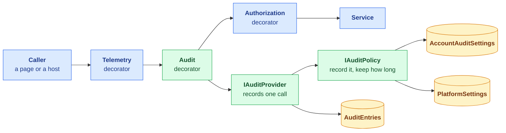
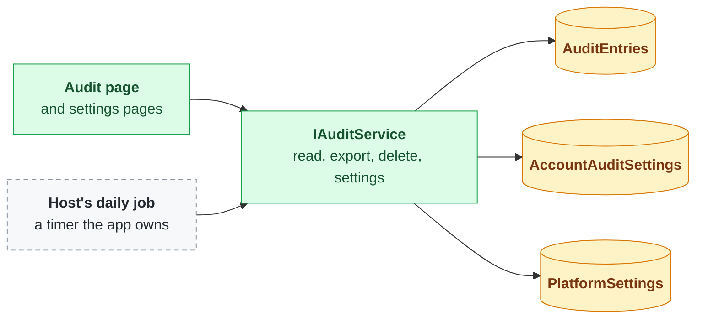
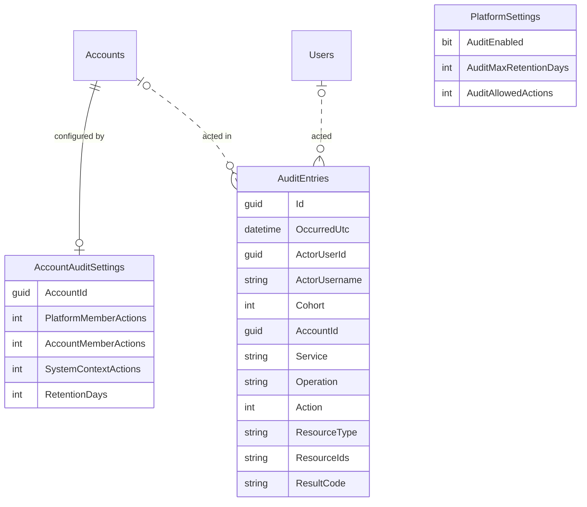
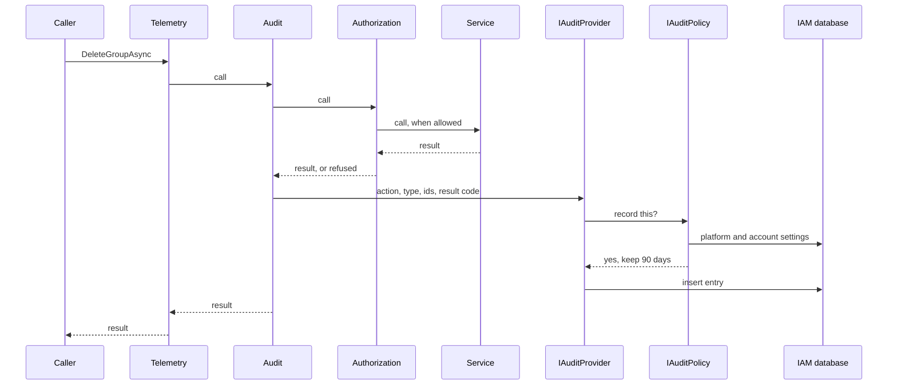

# Auditing

**Status: not started.** Part of the platform account fast follow
([platform-account-hardening.md](platform-account-hardening.md)): no stable IAM release carries the
platform account until this is done. The platform account is out as previews (Corely.IAM
3.4.0-preview.1, IAM.Web 3.3.0-preview.1, the CLI 3.1.0-preview.1).

## Summary

We are building an audit log for IAM and the apps that use it. Every service method can write an
entry saying who did what, in which account, and whether it was allowed. What actually gets written is
up to the platform and to each account:

- **The platform** has a switch for the whole system, a maximum retention, and which actions accounts
  may record.
- **Each account** chooses which actions to record for each kind of user (its own members, platform
  members, background processes) and how long to keep them, within those limits.
- **People read it on one audit page** that covers every account they may see, filter it, export it
  as CSV, and delete entries older than a date. Old entries are also cleaned up daily.

Nothing is recorded about the request's contents, entries cannot be edited, and auditing is added with
the same decorator pattern authorization already uses.

## How it fits together

### Components: writing entries

### Components: reading and managing

Green is new in IAM, blue exists today, amber is new tables, and the dashed grey box is written by
each app, not shipped by IAM. Billing and DocsToData add audit decorators to their own services,
which call the same `IAuditProvider`.

### Tables

The action columns hold CRUDX as flags. `AuditEntries` refers to users and accounts by id with no
foreign key (the dotted lines), so deleting a user does not delete the record of what they did.
`PlatformSettings` is a single row.

### Recording a call

A refused call is recorded the same way, with its refusal code. When the policy says no, nothing is
written and the call returns as normal.

### Reading the audit page

Export runs the same query without paging and returns CSV.

## Why

A platform member's permissions reach every account, and nothing records what anyone did. Auditing
is wanted for everyone, not only platform members: every method of every service can be recorded,
and what is actually recorded is configured, at the platform and per account.

## Decisions

### What an entry is

| Column | Holds |
|--------|-------|
| `Id` | Guid v7, like every other id |
| `OccurredUtc` | From `TimeProvider`. Never read back out of the id |
| `ActorUserId`, `ActorUsername` | Who acted; the username as it was at the time. Empty for system context |
| `Cohort` | Platform member, account member or system context (below) |
| `AccountId` | The account acted in. Empty for operations before an account is chosen, such as signing in |
| `Service`, `Operation` | The service interface and method |
| `Action`, `ResourceType`, `ResourceIds` | The CRUDX action and what it was on |
| `ResultCode` | The result code returned, refusals included |

**No request details.** Nothing from the request body is stored, so no secret or personal data can
land in the log.

**Entries are append-only.** Nothing updates an entry. The only delete is "everything older than a
date" for one account, so no entry can be removed or kept selectively.

### Cohorts

Broad, not per user:

- **Platform members:** a user acting in an account they are not a member of, through the platform
  account.
- **Account members:** a user acting in an account they belong to.
- **System context:** headless processes.

Each cohort has the five CRUDX actions switched on or off. **Default: Create, Update and Delete on;
Read and Execute off,** for every cohort.

### Settings

Typed columns, not a key/value or JSON table: the schema and EF enforce types and defaults, and a new
setting is a migration, which IAM already ships for every schema change.

**`PlatformSettings`**, one row, edited in the platform account:

| Setting | Meaning |
|---------|---------|
| `AuditEnabled` | System-wide switch. Off records nothing anywhere |
| `AuditMaxRetentionDays` | The longest any account may keep entries |
| `AuditAllowedActions` | The CRUDX actions any account may switch on. The platform can forbid Read and Execute logging everywhere |

**`AccountAuditSettings`**, one row per account, edited by the account:

| Setting | Meaning |
|---------|---------|
| Actions per cohort | Which CRUDX actions are recorded for each cohort, within `AuditAllowedActions` |
| `RetentionDays` | 0 up to the platform's `AuditMaxRetentionDays` |

**The account decides.** An account that switches a cohort off, including platform members, gets
nothing recorded for it. The platform does not keep a record of its own members' actions inside a
customer account that the customer has declined.

**`IAuditPolicy`** answers "is this recorded, and for how long" from the platform settings, the
account settings and the cohort. The provider asks it and does nothing else with settings, so a
later rule (a per-account override) changes one type, and the policy is tested on its own.

### Where it runs

- **A hand-written audit decorator per service interface**, each method one call to
  `IAuditProvider` with the action, resource type, ids and result code. This is the pattern
  authorization uses (`CLAUDE.md`: no `DispatchProxy` or other interception).
- **Order: Telemetry, then Audit, then Authorization, then the service.** Audit sits outside
  authorization so refused attempts are recorded with their refusal code; telemetry stays outermost so
  it times the whole call.
- **Every method of every service.** Signing in and switching accounts are authentication service
  methods, so entering an account is recorded like anything else.
- **Hosts audit their own services the same way.** Billing's services get audit decorators in
  Corely.Billing.IAM, which already depends on IAM, and DocsToData's get theirs in DocsToData. Each is
  a release of its own after IAM's.

### Reading and managing it

**`IAuditService`:**

| Action | Method |
|--------|--------|
| Create | Record an entry (the provider's path; not called by pages) |
| Read | List and get, with filters; export as CSV |
| Delete | Delete one account's entries older than a date |

It also reads and updates the account's audit settings and, in the platform account, the platform
settings.

**Two resource types:**

| Type | Actions used |
|------|--------------|
| `audit` | Read: view and export. Delete: delete older than a date |
| `audit_settings` | Read and Update the account's audit settings |

Deleting entries and changing settings are always recorded, whatever the settings say.

**The audit page is not tied to one account.** It lists entries from every account where the caller
holds Read on `audit`, so a platform member holding it in the platform account sees every account,
as Account Read works today. It lives outside the current account, like Profile, with filters for
account, user, action, resource type, result and date, a column marking platform members, and a
filter to include or exclude them. Export downloads what the filters show. This is the first list in
IAM that spans accounts other than the account picker.

**Other pages:** account audit settings in account management; platform settings in the platform
account.

### Retention

**IAM ships the operation, the app ships the schedule.** `IAuditService` has a method that deletes
each account's entries older than its `RetentionDays` and returns how many went. It runs under system
context and is safe to run twice. The app calls it from whatever schedules work there: a timer
triggered function in DocsToData, a hosted service with a timer in a plain web app. IAM ships no
timer, because a Functions app, an App Service that sleeps and a web app scaled across instances each
schedule differently.

People keep what they care about by exporting it before it ages out.

## First version

- The system-wide switch, the maximum retention, and the actions accounts may enable
- Account settings per cohort and action, and the account's retention
- Audit decorators on every IAM service; Billing and DocsToData after
- The cross-account audit page with CSV export, and delete older than a date
- The retention cleanup operation in IAM, and a daily timer function calling it in DocsToData
- The two resource types and their owner defaults

## Later, without redesign

- **Per-account retention beyond the platform maximum** (an account paying to keep five years): one
  nullable override on the account's settings, editable only by platform members, read by
  `IAuditPolicy`.

## Open questions

- **When writing an entry fails,** does the action fail with it (strict, and what audit usually
  means), or go through with the failure logged?
- **What gates the platform settings page:** Update on `audit_settings` held in the platform account,
  or a `platform_settings` type of its own, since that table will hold more than audit later?
- **Deleting an account:** do its entries go with it, or stay until they age out under the platform
  maximum?
- **Turning `AuditEnabled` off:** do existing entries stay until they age out, or go at once?

## Done when

Every IAM service method passes through an audit decorator, what is recorded follows the platform and
account settings, the audit page shows and exports entries across the accounts a caller may read, old
entries are cleaned up on schedule, and Billing and DocsToData audit their own services the same way.
