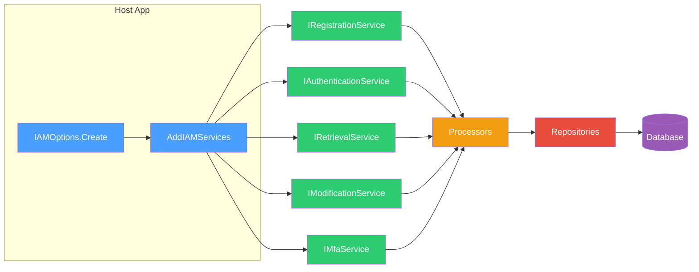

# Corely.IAM

Host-agnostic, multi-tenant identity and access management for .NET applications. Drop-in authentication, authorization, RBAC, and permission management — no external service dependencies.



## Highlights

- **Multi-tenant accounts** — users belong to multiple accounts with scoped RBAC
- **CRUDX permissions** — fine-grained Create / Read / Update / Delete / Execute per resource type
- **Token-based auth** — JWT with custom claims, no HttpContext dependency
- **System context** — headless processes (Azure Functions, background services) can call APIs without user authentication
- **Password recovery** — email-based recovery tokens for unauthenticated password reset
- **Multi-factor authentication** — TOTP (authenticator apps) with recovery codes
- **Google Sign-In** — link Google accounts as an alternative auth method
- **Invitation system** — token-based onboarding with expiry and revocation
- **Per-entity encryption** — account and user-scoped key pairs, stored encrypted
- **Pluggable crypto** — configure algorithms via the `IAMOptions` builder
- **Three database providers** — SQL Server, MySQL, MariaDB via EF Core

## Quick Start

```csharp
// Register services
var options = IAMOptions.Create(configuration, securityConfigProvider, efConfigFactory);
services.AddIAMServices(options);

// Register a user and account
var registrationService = serviceProvider.GetRequiredService<IRegistrationService>();

var userResult = await registrationService.RegisterUserAsync(
    new RegisterUserRequest("admin", "admin@example.com", "P@ssw0rd!"));

var accountResult = await registrationService.RegisterAccountAsync(
    new RegisterAccountRequest("My Organization"));
```

## Documentation

| Docs | Description |
|------|-------------|
| **[Corely.IAM](Corely.IAM/Docs/index.md)** | Core library — setup, services, domains, security, architecture |
| **[Corely.IAM.Web](Corely.IAM.Web/Docs/index.md)** | Pre-built Blazor UI — auth pages, account management, RBAC visualization |
| [DevTools CLI](Corely.IAM.DevTools/Docs/index.md) | Crypto operations and IAM service interaction from the command line |
| [Migration CLI](Corely.IAM.DataAccessMigrations.Cli/Docs/index.md) | Database creation, migrations, and scripting |

## Solution Structure

| Project | Purpose |
|---------|---------|
| `Corely.IAM` | Core library — business logic, data access, security |
| `Corely.IAM.Web` | Blazor Server UI — pages, components, auth flow |
| `Corely.IAM.WebApp` | Host application (reference implementation) |
| `Corely.IAM.UnitTests` | Test suite (xUnit, Moq, AutoFixture, FluentAssertions) |
| `Corely.IAM.DevTools` | Developer CLI for crypto and IAM operations |
| `Corely.IAM.DataAccessMigrations.*` | EF Core migrations per database provider |

## License

See [LICENSE](LICENSE) for details.
